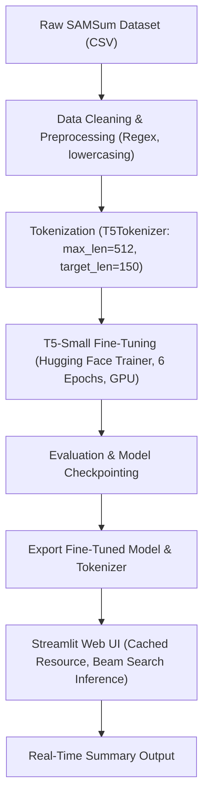

# 📝 Dialogue Text Summarization using Fine-Tuned T5

[](https://www.python.org/)
[](https://pytorch.org/)
[](https://huggingface.co/)
[](https://streamlit.io/)
[](https://opensource.org/licenses/MIT)

An end-to-end Natural Language Processing (NLP) project that fine-tunes Google's **T5-small** (Text-to-Text Transfer Transformer) on the **SAMSum dataset** for dialogue and conversation summarization. It includes an interactive **Streamlit** web application for real-time inference.

---

## 📌 Table of Contents
- [Overview](#-overview)
- [Workflow Architecture](#-workflow-architecture)
- [Key Features](#-key-features)
- [Dataset](#-dataset)
- [Model & Training Details](#-model--training-details)
- [Project Structure](#-project-structure)
- [Installation & Setup](#-installation--setup)
- [Running the Application](#-running-the-application)
- [Training the Model](#-training-the-model)
- [Handling Large Model Weights](#-handling-large-model-weights)
- [Author & Acknowledgements](#-author--acknowledgements)

---

## 📖 Overview

Conversational text (such as chat transcripts, customer support logs, and meeting dialogues) contains informal phrases, slang, and disjointed dialogue turns that make extractive summarization ineffective. 

This project implements an **abstractive summarization** pipeline:
1. Cleans and pre-processes informal dialogues.
2. Tokenizes sequences with the **T5 Tokenizer** (SentencePiece).
3. Fine-tunes the **T5-small** encoder-decoder architecture with Hugging Face `Trainer`.
4. Deploys the model with **Streamlit** for interactive multi-turn dialogue summarization using **Beam Search**.

---

## 📐 Workflow Architecture



---

## ✨ Key Features

- **Abstractive Dialogue Summarization:** Understands conversation context and paraphrases key points into clear summaries rather than just extracting sentences.
- **Pre-trained T5 Foundation:** Leverages Google's `t5-small` sequence-to-sequence transformer model.
- **Beam Search Decoding:** Utilizes 4-beam search generation (`num_beams=4`) with early stopping to yield coherent and fluent summaries.
- **Clean Interactive UI:** Built with Streamlit featuring responsive CSS typography, clear layout, and input samples.
- **Resource Caching:** Uses `@st.cache_resource` to load model weights once into GPU/CPU memory for fast response times.

---

## 📊 Dataset

The model is trained on the **SAMSum corpus**, a dataset containing ~16k chat-style conversations with human-written summaries.

| Split | Number of Samples |
|---|---|
| **Train** (`samsum-train.csv`) | 14,732 dialogues |
| **Validation** (`samsum-validation.csv`) | 818 dialogues |
| **Test** (`samsum-test.csv`) | 819 dialogues |

Each record contains:
- `id`: Unique conversation identifier.
- `dialogue`: The chat or dialogue text between two or more speakers.
- `summary`: The human-annotated ground truth summary.

---

## ⚙️ Model & Training Details

- **Base Model:** `t5-small` (~60 million parameters)
- **Framework:** PyTorch & Hugging Face `transformers`
- **Training Epochs:** 6
- **Batch Size:** 8 per device (train and eval)
- **Optimizer:** AdamW with `weight_decay = 0.01`
- **Learning Rate Warmup:** 500 steps
- **Evaluation Strategy:** Evaluated per epoch on validation set
- **Input Sequence Length:** 512 tokens
- **Summary Sequence Length:** 150 tokens

---

## 📁 Project Structure

```text
Text_summarization/
├── dataset/                        # SAMSum dialogue dataset splits
│   ├── samsum-train.csv
│   ├── samsum-validation.csv
│   └── samsum-test.csv
├── src/
│   ├── __init__.py
│   └── ui.py                       # Streamlit UI styling and theme configuration
├── saved_summary_model/            # Fine-tuned model directory
│   ├── config.json                 # T5 model configuration
│   ├── generation_config.json      # Beam search generation config
│   ├── tokenizer.json              # Tokenizer vocabulary and mappings
│   ├── tokenizer_config.json       # Tokenizer configuration
│   └── README.md                   # Notes on model weights
├── app.py                          # Streamlit web application
├── notebook.ipynb                  # Training, preprocessing & evaluation notebook
├── requirements.txt                # Python package dependencies
├── .gitignore                      # Git ignore rules for PyTorch/checkpoints
├── .gitattributes                  # Git line-ending configuration
├── LICENSE                         # MIT License
└── README.md                       # Project documentation
```

---

## 🚀 Installation & Setup

### 1. Clone the Repository
```bash
git clone https://github.com/jatinsaini01/Text_summarization.git
cd Text_summarization
```

### 2. Create and Activate a Virtual Environment

**Using Conda (Recommended):**
```bash
conda create -n text_sum python=3.11 -y
conda activate text_sum
```

**Using Python venv:**
```bash
python -m venv venv
# On Windows:
.\venv\Scripts\activate
# On Linux/macOS:
source venv/bin/activate
```

### 3. Install Dependencies
```bash
pip install -r requirements.txt
```

> **Note for PyTorch GPU Users:**  
> If you have an NVIDIA GPU (such as RTX 2050/3050/4060), install the CUDA-enabled PyTorch build from [pytorch.org](https://pytorch.org/get-started/locally/):
> ```bash
> pip install torch --index-url https://download.pytorch.org/whl/cu121
> ```

---

## 🖥️ Running the Application

Launch the Streamlit web application:

```bash
streamlit run app.py
```

The app will open automatically in your browser at `http://localhost:8501`.

---

## 📓 Training the Model

To train or reproduce the fine-tuning process from scratch:

1. Open `notebook.ipynb` in VS Code or Jupyter Lab.
2. Select your Python/Conda kernel.
3. Run all cells step-by-step:
   - Data cleaning and inspection
   - Tokenization with `T5Tokenizer`
   - Model initialization (`t5-small`)
   - Trainer execution (`trainer.train()`)
   - Model saving (`model.save_pretrained("./saved_summary_model")`)

---

## 📦 Handling Large Model Weights

GitHub enforces a strict **100 MB file limit**. The trained weights (`model.safetensors` ~ 242 MB) and intermediate training checkpoints in `results/` are excluded by `.gitignore` to prevent repository bloat.

To obtain the trained model weights:
1. **Option A (Train locally):** Run `notebook.ipynb`. It will automatically train the model and save `model.safetensors` into `./saved_summary_model/`.
2. **Option B (Hugging Face Hub):** Push your model to Hugging Face Model Hub using `model.push_to_hub("your-username/t5-samsum-summary")` and load it directly in `app.py`.
3. **Option C (Git LFS):** If you prefer storing weights directly in the repo, track the model with Git Large File Storage:
   ```bash
   git lfs install
   git lfs track "*.safetensors"
   git add .gitattributes
   ```

---

## 👤 Author & Acknowledgements

- **Author:** [Jatin Kumar](https://github.com/jatinsaini01)
- **Institution:** B.Tech CSE, JMIT Radaur
- **Dataset:** [SAMSum Dataset](https://huggingface.co/datasets/samsum) by Samsung R&D Institute Poland
- **Base Architecture:** [Google T5 (Text-to-Text Transfer Transformer)](https://arxiv.org/abs/1910.10683) via Hugging Face

---

## 📄 License

This project is licensed under the [MIT License](LICENSE).
